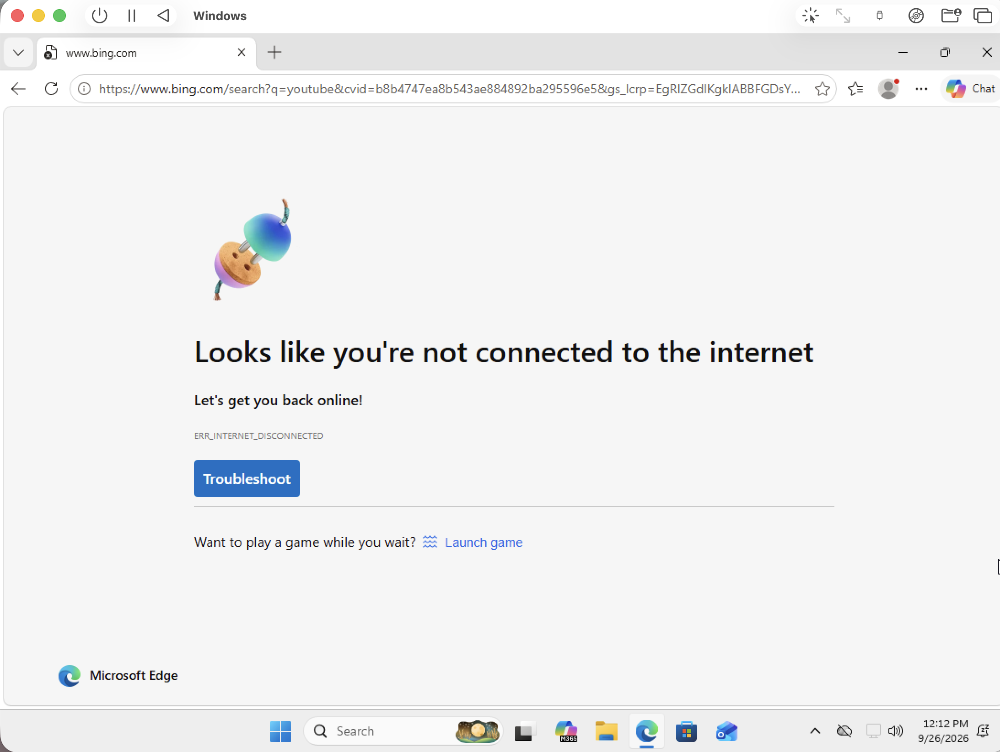
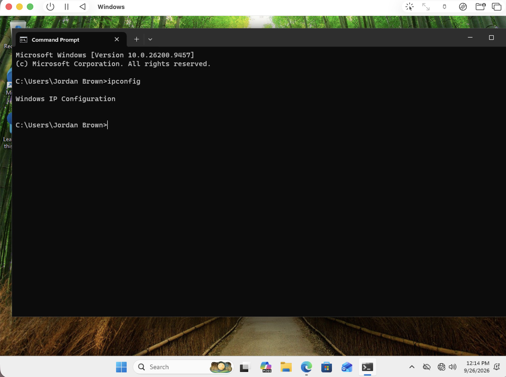
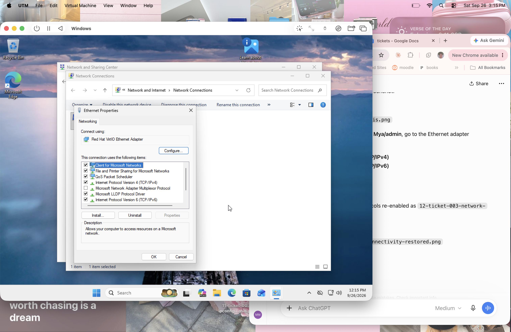
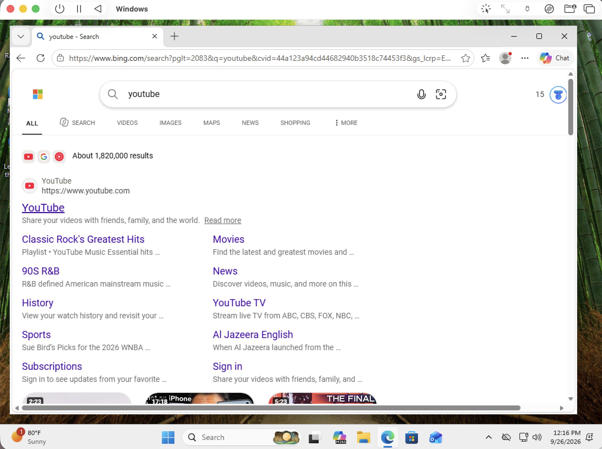

# Ticket #003 — No Internet Connection

**Ticket ID:** 003  
**User:** Jordan Brown  
**Department:** Marketing  
**Issue:** No internet connection  
**Priority:** High  
**Status:** Resolved  

## User Description

Jordan Brown reports that websites are not loading and the computer appears to have lost internet access.

## Resolution Notes

Investigated the user’s reported loss of internet connectivity and reviewed the system’s network configuration. Identified that both TCP/IPv4 and TCP/IPv6 were disabled on the Ethernet adapter. Re-enabled both protocols, verified that the system received network configuration again, and confirmed that Jordan Brown could successfully access websites. Issue resolved.
## Screenshots

### No Internet Connection

### IP Configuration Diagnosis

### Network Protocols Restored

### Connectivity Restored

