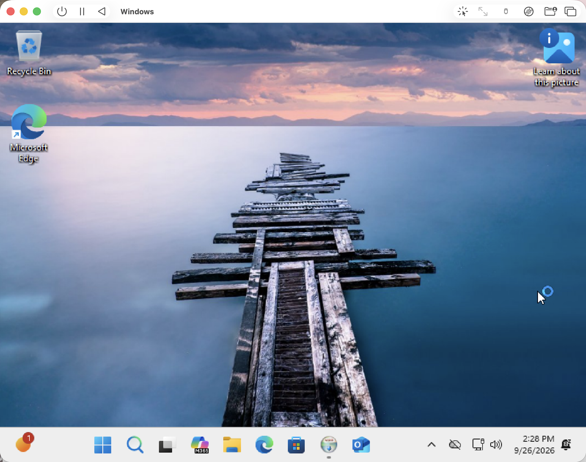
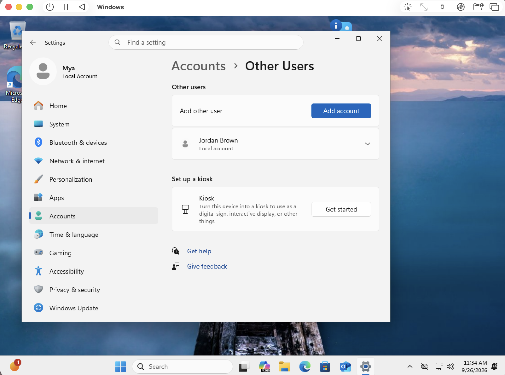

# IT Support Home Lab

## Project Overview

This project simulates a small-business Tier 1 help-desk environment using a Windows 11 virtual machine. I created user accounts, generated realistic technical support issues, troubleshot each problem, implemented solutions, and documented the resolution process.

## Environment

- macOS host system
- UTM virtualization
- Windows 11 Pro ARM64
- Local Windows user accounts
- Windows Computer Management
- NTFS permissions
- Windows networking tools
- Command Prompt

## Skills Practiced

- Windows user administration
- Password resets
- Local account management
- File and folder permissions
- Network troubleshooting
- TCP/IP configuration
- Command-line troubleshooting
- Technical ticket documentation
- End-user support
## Lab Setup

## Support Tickets

### Ticket #001 — Password Reset
[View Ticket #001](ticket-001-password-reset.md)

### Ticket #002 — Access Denied to Marketing Folder
[View Ticket #002](ticket-002-folder-permissions.md)

### Ticket #003 — No Internet Connection
[View Ticket #003](ticket-003-network-connectivity.md)

## Project Progress

Completed:
- Windows 11 virtual machine setup
- Local user administration
- Password reset troubleshooting
- NTFS folder permission troubleshooting
- Network connectivity troubleshooting

Planned next:
- Windows Server
- Active Directory
- Domain user management
- Shared network resources
- Additional Tier 1 support scenarios
