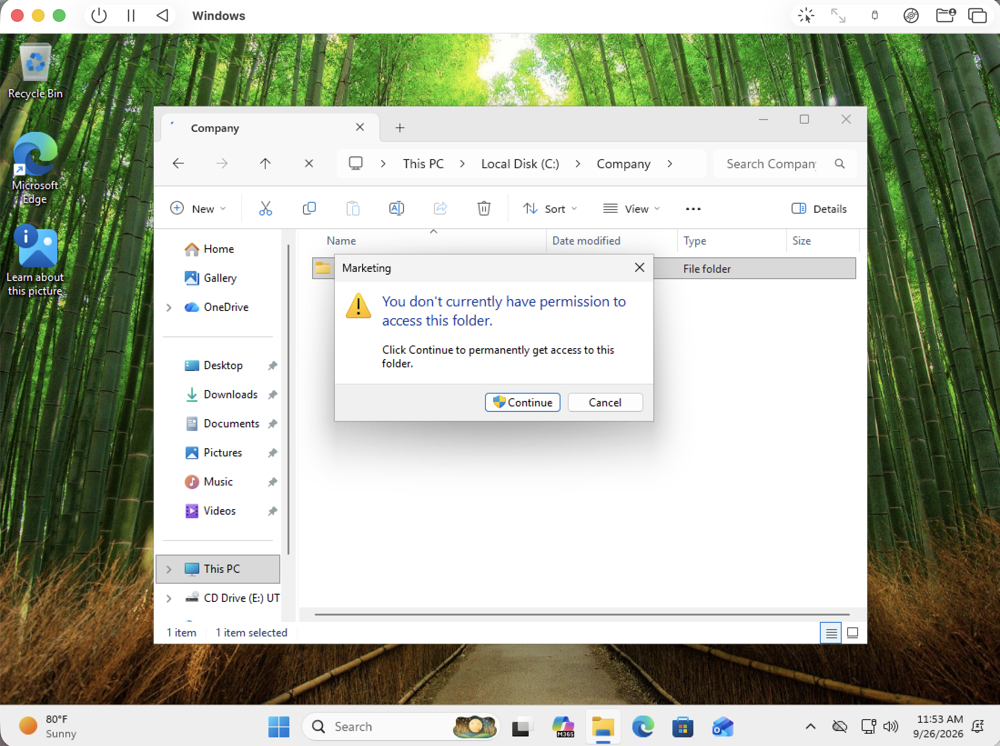
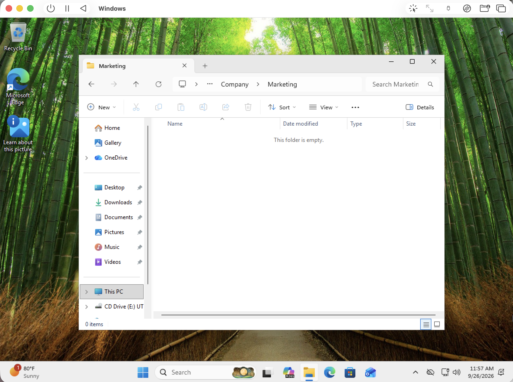

# Ticket #002 — Access Denied to Marketing Folder

**User:** Jordan Brown  
**Department:** Marketing  
**Issue:** User cannot open the Marketing shared folder  
**Priority:** Medium  
**Status:** Resolved  

## User Description

Jordan Brown reports receiving an “Access Denied” message when attempting to open the Marketing folder at `C:\Company\Marketing`.

## Resolution Notes

Reviewed the Marketing folder’s security permissions and identified an explicit Deny permission assigned to Jordan Brown. Removed the incorrect Deny permissions, then verified that Jordan could successfully open and access the `C:\Company\Marketing` folder. Issue resolved.
## Screenshots

### Access Denied

### Permissions Corrected

### Access Restored

